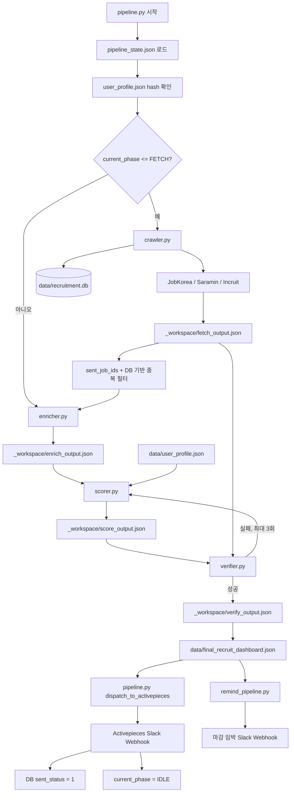

# 채용 파이프라인 아키텍처

이 문서는 `workspace/recruiting-pipeline` 기준으로 현재 소스 코드와 실행 데이터 흐름을 정리합니다. 파이프라인의 목표는 채용 공고 수집, 기업 정보 보강, 사용자 프로필 기반 스코어링, 검증, Activepieces Slack push 전송을 체크포인트 방식으로 반복 수행하는 것입니다.

---

## 1. 현재 디렉터리 구조

```text
project/
├── Agents.md
├── Architecture.md
├── README.md
├── requirements.txt
├── pipeline_flow.png
├── .claude/
│   ├── agents/
│   │   ├── recruiting-pipeline-agent.md
│   │   ├── verifier-agent.md
│   │   ├── crawling-expert.md
│   │   ├── backend-dev.md
│   │   ├── frontend-dev.md
│   │   └── ...
│   └── skills/
│       ├── recruiting-pipeline-orchestrator/SKILL.md
│       ├── crawling-orchestrator/SKILL.md
│       ├── jobkorea-dev-orchestrator/SKILL.md
│       └── ...
└── workspace/
    └── recruiting-pipeline/
        ├── common.py
        ├── pipeline.py
        ├── crawler.py
        ├── enricher.py
        ├── scorer.py
        ├── verifier.py
        ├── remind_pipeline.py
        ├── data/
        │   ├── pipeline_state.json
        │   ├── recruitment.db
        │   ├── user_profile.json
        │   └── final_recruit_dashboard.json
        └── _workspace/
            ├── fetch_output.json
            ├── enrich_output.json
            ├── score_output.json
            └── verify_output.json
```

`common.py`가 경로 상수를 한 곳에서 정의합니다. 영구 상태와 DB는 `workspace/recruiting-pipeline/data/`에 있고, 단계별 중간 산출물은 `workspace/recruiting-pipeline/_workspace/`에 저장됩니다.

---

## 2. 실행 흐름



각 단계가 시작될 때 `pipeline.py`는 `current_phase`를 `[FETCH] -> [ENRICH] -> [SCORE] -> [VERIFY] -> [DISPATCH]` 순서로 갱신합니다. 프로세스가 중간에 끊기면 다음 실행에서 해당 단계부터 재개할 수 있습니다.

---

## 3. 핵심 컴포넌트

### common.py

- `BASE_DIR`, `DATA_DIR`, `WORKSPACE_DIR` 및 주요 JSON/DB 경로를 정의합니다.
- `read_json`, `write_json`, `post_json`으로 파일 I/O와 webhook POST를 표준화합니다.
- `normalized_job_key()`로 회사명과 공고명을 정규화해 중복 판정에 사용합니다.
- `init_openai_client()`는 `OPENAI_API_KEY`가 없거나 SDK 초기화가 실패하면 `None`을 반환해 로컬 fallback 경로가 동작하게 합니다.

### pipeline.py

- 전체 루프의 상태 머신입니다.
- `pipeline_state.json`을 읽고 `current_phase`, `last_processed_id`, `sent_job_ids`, `user_profile_hash`를 관리합니다.
- `crawler.py`, `enricher.py`, `scorer.py`, `verifier.py`, `remind_pipeline.py`를 서브프로세스로 실행합니다.
- 검증 성공 후 `verify_output.json`을 `final_recruit_dashboard.json`으로 복사하고 Activepieces webhook으로 Slack push를 보냅니다.
- 전송 성공 시 `sent_job_ids`와 `last_processed_id`를 갱신하고, `detail_url` 기준으로 SQLite `sent_status = 1`을 업데이트합니다.
- `preprocess_multi_source_payload()`는 Slack 템플릿이 쓰기 쉽도록 `job_keywords_string`을 만들고, JD 텍스트가 실제로 부족할 때만 원본 이미지 링크 fallback을 사용합니다.

### crawler.py

`FETCH` 단계의 수집기입니다. 결과는 DB에 저장되고, 아직 전송되지 않은 공고만 `_workspace/fetch_output.json`으로 출력됩니다.

- 공통 기능
  - 잡코리아, 사람인, 인크루트를 수집합니다.
  - `parse_clean_deadline()`으로 `D-5`, `2026.07.01`, `오늘`, `내일`, `상시채용`, `채용시 마감` 등을 표준화합니다.
  - 제목에 섞인 `D-숫자스크랩` 조각을 제거합니다.
  - 기본 placeholder 이미지는 사용하지 않고, 실제 공고에서 찾은 원본 이미지만 `image_url`로 전달합니다.

- 잡코리아 상세 수집
  - 기존 HTML selector 기반 파싱을 먼저 수행합니다.
  - Next/React Flight 응답 안의 `job-hub-files..._DESCRIPTION.html`, `job-hub-files..._OCR.html` presigned URL을 추출합니다.
  - 해당 DESCRIPTION/OCR HTML을 직접 요청해 이미지형 공고와 JavaScript 청크형 공고의 텍스트를 확보합니다.
  - 추출 결과는 `jd_summary`, `responsibilities`, `requirements`, `preferences`, `scraped_image_url`, `description_source_urls`, `detail_extraction_method`로 저장합니다.
  - HTML과 청크 수집이 부실할 때만 로컬에 Playwright가 설치된 경우 렌더링 fallback을 시도합니다.

### enricher.py

`ENRICH` 단계의 기업 컨텍스트 보강기입니다.

- `LOCAL_DART_DB`, `LOCAL_PENSION_DB`에 있는 기업은 로컬 매핑을 우선 사용합니다.
- OpenAI client가 있으면 기업 규모, 주요 사업, 중장기 계획, 안정성 점수를 JSON 형태로 보강합니다.
- 상세 JD가 부실하고 실제 이미지 URL이 있는 경우 GPT-4o Vision OCR 경로를 사용할 수 있습니다.
- 출력은 `_workspace/enrich_output.json`입니다.

### scorer.py

`SCORE` 단계의 정형화 및 스코어링 엔진입니다.

- 사용자 프로필(`user_profile.json`)과 공고 제목/JD를 비교해 `fit_score`를 계산합니다.
- OpenAI client가 있으면 `response_format={"type": "json_object"}`로 정형 JSON을 요청합니다.
- OpenAI client가 없거나 응답이 부실하면 로컬 규칙 기반 fallback이 동작합니다.
- 크롤러가 전달한 `requirements`, `preferences`, `responsibilities`를 우선 사용하되, Slack에 긴 OCR 원문이 나가지 않도록 최종 단계에서 한 줄 핵심 요약으로 압축합니다.
- `#직무역량 #자소서작성 #성장가능성` 같은 고정 placeholder 키워드를 제거하고, JD/기업 insight/직무 기술 기반으로 `job_keywords`를 생성합니다.
- placeholder 이미지, 오래된 fallback 문구, 과도하게 긴 후보값을 정리합니다.
- 출력은 `_workspace/score_output.json`입니다.

### verifier.py

`VERIFY` 단계의 독립 검증기입니다.

- 필수 payload key가 모두 존재하는지 확인합니다.
- `fit_score`, `analysis`, `company_insight`, `job_keywords` 형식을 검사합니다.
- 원본 `fetch_output.json`과 최종 `score_output.json`의 마감년도 불일치를 감지합니다.
- 금지된 fallback 문구, 고정 키워드, placeholder 이미지 URL이 최종 payload에 남아 있으면 실패 처리합니다.
- 성공 시 `_workspace/verify_output.json`을 씁니다.

### remind_pipeline.py

마감 임박 리마인더입니다.

- `final_recruit_dashboard.json`에서 마감일을 읽습니다.
- D-day가 0-3일인 공고만 별도 Activepieces webhook으로 보냅니다.

---

## 4. 데이터 계약

최종 Slack payload는 아래 필드를 기본 계약으로 사용합니다.

```json
{
  "company": "string",
  "title": "string",
  "employment_type": "string",
  "location": "string",
  "salary": "string",
  "requirements": "string",
  "preferences": "string",
  "jd_summary": "string",
  "job_keywords": ["string"],
  "job_keywords_string": "string",
  "detail_url": "string",
  "company_career_url": "string",
  "deadline": "string",
  "image_url": "string",
  "fit_score": 0,
  "analysis": {
    "job_category": "string",
    "location_score": "string",
    "jd_summary": "string",
    "welfare": "string"
  },
  "company_insight": {
    "company_size": "string",
    "primary_industry": "string",
    "mid_long_term_plan": "string",
    "stability": "string",
    "stability_score": "string"
  }
}
```

중요한 출력 규칙은 다음과 같습니다.

- `requirements`, `preferences`, `jd_summary`는 원문 전체가 아니라 핵심 요약 한 줄이어야 합니다.
- JD 텍스트를 확보하지 못한 경우에만 `image_url` 기반 Slack 링크를 사용합니다.
- `job_keywords`는 기업 방향성, 인재상, 직무 기술, 사용자 프로필을 조합해 생성합니다.
- Slack 템플릿 편의를 위해 `job_keywords_string`도 함께 전달합니다.

---

## 5. 중복 방지와 재시작 전략

- DB 레벨에서는 `normalized_key`와 `UNIQUE(company, title)`로 같은 공고의 중복 저장을 막습니다.
- 루프 레벨에서는 `pipeline_state.json.sent_job_ids`와 `last_processed_id`로 이미 Slack에 전송된 공고를 필터링합니다.
- Activepieces 전송 성공 후에만 DB `sent_status`가 `1`로 변경됩니다.
- 각 phase 진입 시 `current_phase`가 즉시 저장되므로 서버 재시작 이후에도 마지막 진행 단계부터 이어갈 수 있습니다.

---

## 6. 외부 연동

- 잡코리아/사람인/인크루트: 채용 공고 목록과 상세 공고 수집 대상입니다.
- JobKorea `job-hub-files` S3 DESCRIPTION/OCR HTML: 이미지형/JS 청크형 잡코리아 상세 공고의 핵심 텍스트 수집 경로입니다.
- OpenAI API: 기업 정보 보강, 이미지 OCR fallback, 공고 정형화에 선택적으로 사용됩니다.
- Activepieces: 최종 Slack dashboard push와 마감 임박 리마인더 push를 담당합니다.
- SQLite: 수집 공고, 상세 크롤링 JSON, 전송 상태를 저장합니다.

---

## 7. 운영 검증 명령

```powershell
cd C:\Users\MyDream\Desktop\git\project\workspace\recruiting-pipeline
python -m py_compile common.py crawler.py enricher.py scorer.py pipeline.py verifier.py remind_pipeline.py
python -X utf8 verifier.py
```

잡코리아 OCR/청크 수집 단건 확인 예시는 다음과 같습니다.

```powershell
$env:PYTHONIOENCODING='utf-8'
@'
from crawler import deep_scrape_detail
info = deep_scrape_detail("https://www.jobkorea.co.kr/Recruit/GI_Read/49422447")
print(info["detail_extraction_method"])
print(info["requirements"][:120])
print(info["preferences"][:120])
print(info["jd_summary"][:200])
'@ | python -X utf8 -
```
