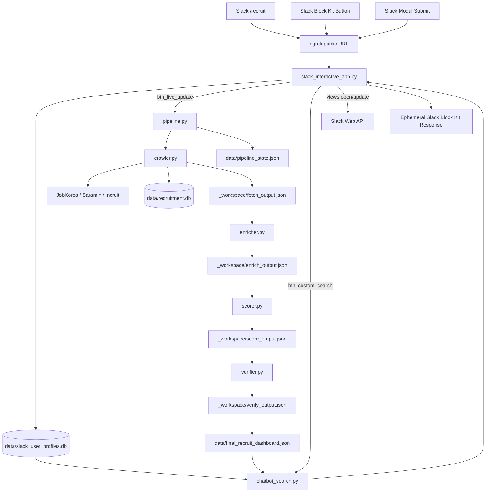

# 채용 파이프라인 아키텍처

현재 서비스는 Activepieces를 사용하지 않습니다. `pipeline.py`는 채용 데이터를 생산하고, `slack_interactive_app.py`가 ngrok public URL을 통해 Slack Block Kit 요청과 응답을 직접 처리합니다.

## 1. 디렉터리 구조

```text
project/
├── Agents.md
├── Architecture.md
├── README.md
├── requirements.txt
├── pipeline_flow.png
└── workspace/
    └── recruiting-pipeline/
        ├── common.py
        ├── crawler.py
        ├── enricher.py
        ├── scorer.py
        ├── verifier.py
        ├── pipeline.py
        ├── chatbot_search.py
        ├── slack_interactive_app.py
        ├── run_server.py
        ├── slack-launcher-blocks.json
        ├── slack-search-preferences-modal.json
        ├── data/                 # ignored
        └── _workspace/           # ignored
```

## 2. 전체 흐름



## 3. 컴포넌트

### common.py

- 경로 상수와 JSON 파일 입출력을 제공합니다.
- OpenAI client lazy initialization을 담당합니다.
- 회사명/공고명 정규화 키를 생성합니다.
- 외부 webhook 전송 helper는 제거되었습니다.

### crawler.py

- JobKorea, Saramin, Incruit 공고 목록과 상세 페이지를 수집합니다.
- 잡코리아의 이미지형/JavaScript 청크형 공고에서 DESCRIPTION/OCR HTML source를 추출합니다.
- 마감일 문자열을 `D-n`, `YYYY.MM.DD`, 상시/채용시 형태로 정리합니다.
- SQLite `jobs` 테이블에 저장하고 미처리 공고를 `_workspace/fetch_output.json`으로 씁니다.

### enricher.py

- 기업명 기준 로컬 DART/국민연금 캐시를 우선 조회합니다.
- OpenAI API가 설정된 경우 기업 context와 vision fallback을 보강합니다.
- 실패 시 로컬 fallback 데이터로 파이프라인을 계속 진행합니다.

### scorer.py

- 공고 상세 텍스트를 표준 Slack payload schema로 정형화합니다.
- `requirements`, `preferences`, `jd_summary`를 한 줄 핵심 요약으로 압축합니다.
- 고정 placeholder 키워드를 제거하고 기업/직무 기반 `job_keywords`를 생성합니다.
- `fit_score`, `analysis`, `company_insight`를 채웁니다.

### verifier.py

- 최종 payload 필수 key와 타입을 검증합니다.
- 부실 fallback 문구, 고정 키워드, placeholder 이미지, 마감년도 불일치를 검사합니다.
- 성공 시 `_workspace/verify_output.json`을 씁니다.

### pipeline.py

- `FETCH -> ENRICH -> SCORE -> VERIFY -> DISPATCH` 체크포인트 상태 머신입니다.
- 현재 `DISPATCH`는 외부 전송이 아니라 직접 Slack 서빙용 결과 확정 단계입니다.
- `verify_output.json`을 `final_recruit_dashboard.json`으로 복사합니다.
- 처리 완료 공고의 `sent_job_ids`, `last_processed_id`, DB `sent_status`를 갱신합니다.

### chatbot_search.py

- 저장된 최종 공고와 Slack 사용자 프로필을 hard matching합니다.
- 희망지역, 희망연봉, 보유자격, 기술스택, 경력 구분, 경험 요약, 어학 점수를 점수에 반영합니다.
- 추천 결과는 Slack Block Kit 카드로 렌더링 가능한 표준 payload로 반환합니다.

### slack_interactive_app.py

- FastAPI 기반 Slack 직접 연동 서버입니다.
- `POST /slack/interactive`: 버튼, 모달 submit, Block Kit interaction 처리
- `POST /slack/command`: `/recruit` slash command 처리
- `GET /slack/launcher-blocks`: 시작 버튼 Block Kit JSON 반환
- `GET /health`: 서버 상태 확인
- Slack Web API `views.open`, `views.update`를 사용해 개인정보/환경설정 모달을 엽니다.

## 4. Slack 인터랙션

### Slash Command

```text
/recruit
/recruit 업데이트
/recruit 검색
/recruit 공고검색
/recruit 공고검색 AI
/recruit 스크랩
/recruit 프로필
/recruit 설정
```

### 버튼

- `btn_live_update`: 파이프라인 실행 후 최신 채용 중 공고 10개 표시
- `btn_custom_search`: 개인 프로필 기반 추천 공고 표시
- `btn_next_recommendation`: 다음 추천 공고로 카드 교체
- `btn_search_jobs`: 일반 공고 검색 모달 열기. 기본 검색 범위는 제목, 회사명, 지역, 자격요건, 우대요건, 직무기술서, 키워드를 포함한 전체 텍스트입니다.
- `btn_search_page_prev` / `btn_search_page_next`: 검색 결과 페이지 이동
- `btn_search_jobs_again`: 검색 모달 다시 열기
- `btn_scrap_single`: 최신 업데이트, 맞춤 추천, 일반 검색 결과에서 단일 공고 스크랩
- `btn_scrap_jobs`: 스크랩 소스 선택 메뉴 열기, 보조 경로
- `btn_scrap_source_crawled`: 최근 크롤링 공고 중 스크랩할 공고 선택
- `btn_scrap_source_recommended`: 맞춤 추천 공고 중 스크랩할 공고 선택
- `btn_scrap_source_search`: 최근 검색 결과 중 스크랩할 공고 선택
- `btn_scrap_view`: 사용자별 스크랩 공고 목록 조회
- `btn_user_profile`: 개인정보 입력/수정 모달
- `btn_delete_profile`: 개인정보 삭제 후 완료 모달
- `btn_search_preferences`: 검색/알림 환경설정 모달

## 5. 데이터 저장소

- `data/recruitment.db`: 수집 공고와 상세 크롤링 JSON
- `data/slack_user_profiles.db`: Slack user id별 개인정보와 환경설정
- `data/slack_user_profiles.db.user_job_scraps`: 사용자별 스크랩 공고
- `data/slack_user_profiles.db.user_job_selection_cache`: 스크랩 체크박스 후보 캐시
- `data/pipeline_state.json`: 체크포인트, 중복 처리 key, 마지막 실행 상태
- `data/final_recruit_dashboard.json`: Slack 검색/추천에 사용하는 최종 검증 결과
- `_workspace/*.json`: 단계별 중간 산출물

`data/`와 `_workspace/`는 운영 로컬 상태이므로 git에 커밋하지 않습니다.

## 6. 제거된 Activepieces 구조

삭제 또는 제거된 항목:

- `remind_pipeline.py`
- `send-activepieces-test.ps1`
- `activepieces-test-payload.json`
- `pipeline.py`의 Activepieces webhook dispatch
- `common.py`의 `post_json`

현재 Slack push, search, modal, command는 모두 ngrok public URL로 들어온 요청을 `slack_interactive_app.py`가 직접 처리합니다.

## 7. 실행 및 검증

```powershell
cd C:\Users\MyDream\Desktop\git\project\workspace\recruiting-pipeline
$env:SLACK_BOT_TOKEN="xoxb-..."
python -X utf8 slack_interactive_app.py
```

```powershell
ngrok http 8000 --domain=<ngrok-domain>
```

```powershell
cd C:\Users\MyDream\Desktop\git\project
python -m py_compile `
  workspace\recruiting-pipeline\common.py `
  workspace\recruiting-pipeline\crawler.py `
  workspace\recruiting-pipeline\enricher.py `
  workspace\recruiting-pipeline\scorer.py `
  workspace\recruiting-pipeline\pipeline.py `
  workspace\recruiting-pipeline\verifier.py `
  workspace\recruiting-pipeline\chatbot_search.py `
  workspace\recruiting-pipeline\slack_interactive_app.py
```
