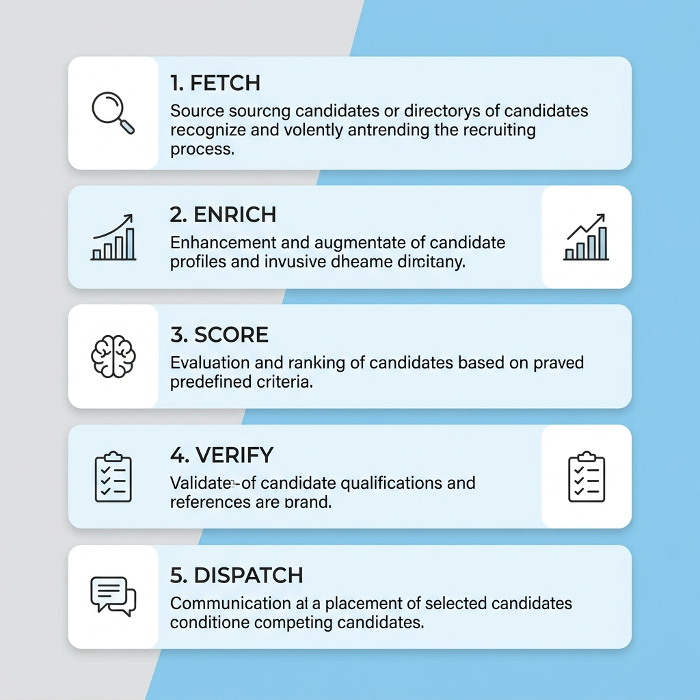

# 🚀 AI 기반 초개인화 무인 채용 파이프라인 서비스

본 서비스는 **JobKorea, Saramin, Incruit** 채용 플랫폼을 통합 수집하고, DART 및 국민연금 데이터를 연동한 뒤, 유저의 프로필과 채용 정보를 실시간 매칭하여 **Slack 맞춤형 알림 대시보드**로 송출하는 무인 채용 정보 서비스입니다.

---

## 📌 전체 시스템 아키텍처 및 흐름도



---

## 🛠️ 핵심 기능 및 기술 구현 사항

1. **다중 플랫폼 통합 수집 & 일원화 (Multi-Platform Consolidation)**
   - **JobKorea, Saramin, Incruit** 3개 구인 플랫폼의 검색 데이터를 실시간 수집 및 통합합니다.
   - 플랫폼별 파편화된 정보를 단일한 데이터 스키마로 표준화(일원화)하여 후속 파이프라인의 안전성을 보장합니다.

2. **SQLite 기반 누적 적재 및 중복 방지 (Deduplication & DB Accumulation)**
   - `data/recruitment.db` 로컬 데이터베이스를 도입하여 수집된 정보를 누적 저장합니다.
   - `UNIQUE(company, title)` 제약 조건을 적용하여 동일 기업의 동일한 채용 공고 수집을 원천 차단하고 `sent_status` 컬럼으로 전송 여부를 추적합니다.

3. **안정적인 자율 에러 회복 (Error Resilience & Lazy Initialization)**
   - `enricher.py` 내 OpenAI 클라이언트를 Lazy-Loading(지연 초기화)하여, `OPENAI_API_KEY` 환경 변수가 누락되거나 API 오류가 나더라도 오류를 무시하고 Mock 및 Vision fallback 데이터를 활용해 전체 루프가 중단 없이 끝까지 진행됩니다.

4. **공고 원본 다이렉트 랜딩 (Direct Detail Landing)**
   - `detail_url` 정보를 파이프라인 전 과정(FETCH ➔ DISPATCH)에 걸쳐 유지합니다.
   - Slack의 채용 공고 상세 보기 버튼을 클릭했을 때 포털 메인이 아닌 **개별 상세 공고 포스팅 글**로 다이렉트 랜딩되도록 연결합니다.
   - 이미지 크롤링 실패 또는 보안 사이트(Posco 등) 이미지 로딩 불량 시, Wikipedia 대신 해당 공고의 `detail_url`을 원본 이미지 대체 경로로 활용합니다.

5. **Windows 환경 UTF-8 처리 보장**
   - Windows 터미널의 기본 CP949 인코딩으로 인한 이모지 및 다국어 텍스트 출력 오류를 막기 위해, Python의 `-X utf8` 실행 플래그를 서브프로세스에 강제 매핑합니다.

---

## 🧩 2026-06-23 Codex 리팩토링 작업 기록

Codex는 기존 Antigravity/Claude 에이전트들이 구성한 파이프라인 아키텍처를 유지하면서, 실행 안정성과 스키마 정합성을 중심으로 소스 코드를 리팩토링했습니다.

- `workspace/recruiting-pipeline/common.py`를 추가하여 경로 상수, JSON 입출력, OpenAI Lazy Initialization, HTTP POST, 채용공고 중복키 정규화를 공통화했습니다.
- `pipeline.py`의 체크포인트 흐름을 보강하여 `DISPATCH` 단계 재시작 시 전송 단계가 누락되지 않도록 수정했습니다.
- Slack/Activepieces 전송 로직을 개선하여 최종 검증 결과가 배열일 때 첫 번째 공고만 보내지 않고 모든 신규 공고를 순회 전송하도록 변경했습니다.
- `scorer.py`와 `verifier.py`의 스키마 계약을 맞춰, 기존 Slack용 flat payload와 에이전트 명세의 `analysis`, `company_insight`, `deadline`, `fit_score` 필드를 함께 보장하도록 정리했습니다.
- `crawler.py`의 회사명/공고명 정규화 로직을 안전하게 교체하여 중복키 생성 시 한글 회사명이 과도하게 삭제되는 문제를 완화했습니다.
- `remind_pipeline.py`의 webhook 호출에 timeout 및 실패 로그를 적용하여 외부 전송 실패가 루프 전체를 불필요하게 붙잡지 않도록 했습니다.
- `requirements.txt`를 추가하고 Python 캐시 파일 ignore 규칙을 보강했습니다.

검증 내역:
- 전체 Python 소스에 대해 `py_compile` 문법 검사를 통과했습니다.
- 샘플 데이터 기준 `fetch_output.json` ➔ `score_output.json` ➔ `verifier.py` 흐름이 강화된 verifier 규칙을 통과했습니다.
- GitHub 원격 저장소 `main` 브랜치에 커밋 `0504daf`(`refactor: harden recruiting pipeline architecture`)로 반영했습니다.

---

## ⏱️ 단계별 상세 워크플로우

### 1️⃣ 1단계: 수집 (FETCH)
- 30분 주기로 스케줄러가 작동하여 JobKorea, Saramin, Incruit를 크롤링합니다.
- 수집된 신규 채용 정보는 SQLite DB(`data/recruitment.db`)에 `sent_status = 0`으로 삽입됩니다.
- 미전송 신규 항목들을 `_workspace/fetch_output.json`으로 출력합니다.

### 2️⃣ 2단계: 기업 확장 (ENRICH)
- 기업명을 Key로 금융감독원 DART API 및 국민연금 데이터를 결합하여 기업 규모, 성장 추이, 경영계획 정보를 덧붙입니다.

### 3️⃣ 3단계: 매칭 연산 (SCORE)
- `data/user_profile.json` 내 유저의 개인 커리어, 선호 스택, 선호 지역 및 학력을 변수로 삼아 **코사인 유사도(Cosine Similarity)**를 연산하고 적합도 점수(0~100)를 산출합니다.

### 4️⃣ 4단계: 검증 (VERIFY)
- 독립적인 Verifier 프로세스를 통해 데이터의 정형성 및 누락 필드, 데이터 모순(연도 불일치 등)을 최종 셀프 체크합니다.

### 5️⃣ 5단계: 슬랙 전송 (DISPATCH)
- Activepieces Webhook을 호출하여 여러 신규 공고를 Slack Block Kit으로 각각 순회 전송하고, 최종 성공한 공고는 SQLite DB 내 `sent_status = 1`로 마킹하여 중복 전송을 완벽히 방지합니다.

---

## 📋 적합도(Fit-Score) 산정 기준 (Criteria)

1. **기본 점수**: **50점**으로 시작합니다.
2. **기술 스택 매칭**: `user_profile.json` 내 `skills` 배열(예: AI, ML, Python, Data Pipeline)의 키워드가 공고 제목 및 요약에 존재할 때마다 **개당 +8점**을 가산합니다.
3. **선호 지역 매칭**: 공고 위치 정보와 유저의 선호 지역이 일치할 시 **+10점**을 가산하고 `"선호 지역 일치"` 라벨을 슬랙에 반환합니다.
4. **정규화**: 산출된 점수는 `0 ~ 100점` 범위 내로 최종 제한 및 환산됩니다.

---

## 💾 최종 서빙 데이터 스키마 명세
```json
{
  "company": "㈜포스코",
  "title": "2026년 포스코 AI 전문인력 채용",
  "detail_url": "https://www.jobkorea.co.kr/Recruit/GI_Read/49351471",
  "deadline": "~2026.07.05(일)",
  "fit_score": 68,
  "analysis": {
    "job_category": "IT / 데이터 / AI",
    "location_score": "95점 (선호 지역 일치)",
    "jd_summary": "공고 상세 직무 내용을 참조하십시오.",
    "welfare": "주5일제, 4대보험"
  },
  "company_insight": {
    "company_size": "대기업",
    "mid_long_term_plan": "생산 공정 전반의 초자동화를 위한 인공지능(AI) 인프라 도입 및 디지털 트랜스포메이션 가속화",
    "stability": "최상 (국민연금 가입자 최근 1년 4.2% 증가)"
  },
  "image_url": "https://recruit.posco.com/h22a01-front/images/dext5editordata/2026/06/20260618_165839478_32781.jpeg"
}
```
