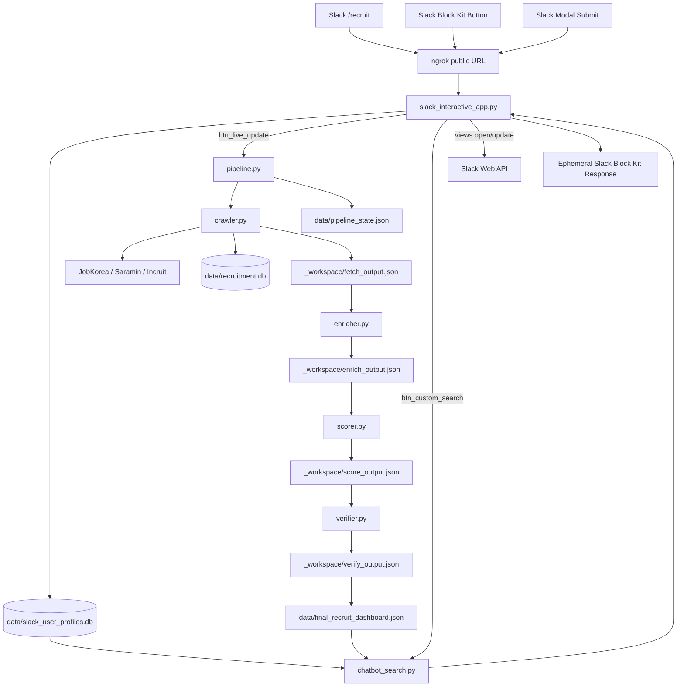

# [팀 회의 브리핑 자료] sw_project 개발 현황, 구조 및 개선 방향

이 문서는 **내일 팀 회의**에서 사용할 수 있도록 `sw_project`(AI 맞춤형 채용 파이프라인)의 개발 현황, 아키텍처 구조, 그리고 향후 개선 방향을 요약한 브리핑 자료입니다. 

---

## 📌 1. 3분 브리핑용 말하기 스크립트 (Speech Script)

> 💡 **Tip:** 아래 텍스트를 그대로 읽거나 참고하셔서 발표하시면 됩니다.

---

### **[인사 및 개요]**
"안녕하세요. 내일 회의에 맞춰 우리 팀에서 개발 중인 **'AI 맞춤형 채용 파이프라인 서비스(sw_project)'**의 현재 개발 현황과 시스템 구조, 그리고 앞으로 고도화할 과제들에 대해 짧게 브리핑해 드리겠습니다."

### **[1. 개발 현황]**
"먼저 개발 현황입니다.
본 서비스는 잡코리아, 사람인, 인크루트 등 주요 채용 사이트의 공고를 자동으로 수집하고, OpenAI API와 로컬 데이터를 활용하여 기업 정보와 채용 자격을 정형화한 뒤, 사용자 프로필에 맞춰 공고를 실시간으로 필터링하고 추천해 주는 **로컬 운영형 챗봇 서비스**입니다.

이전에는 Activepieces와 Webhook을 연동하여 알림을 전달하는 방식이었는데, 구조적 복잡성을 줄이고 실시간성을 높이기 위해 **Activepieces 연동을 전면 제거**했습니다. 대신 FastAPI와 ngrok을 사용해 **Slack Block Kit을 직접 렌더링하고 사용자 요청(버튼 클릭, 모달 입력 등)을 단일 서버에서 다이렉트로 처리하는 구조**로 개편을 완료했습니다."

### **[2. 시스템 아키텍처 및 데이터 흐름]**
"다음으로 시스템의 전체적인 구조를 말씀드리겠습니다.
이 시스템은 크게 **수집-보강-점수화-검증-배포**의 5단계 파이프라인 상태 머신으로 동작합니다.

1. **FETCH(수집):** `crawler.py`가 채용 사이트에서 목록과 상세 페이지를 긁어옵니다. 특히 잡코리아의 이미지 형태나 복잡한 JS 청크 공고도 OCR과 텍스트 추출 기술을 사용해 원문을 빈틈없이 확보하여 SQLite DB에 저장합니다.
2. **ENRICH(보강):** 수집된 공고의 기업명을 기반으로 DART나 국민연금 등의 로컬 캐시를 우선 조회하고, 추가로 OpenAI Vision API를 활용해 기업 규모, 산업적 성장 맥락 등의 컨텍스트를 보강합니다.
3. **SCORE(점수화):** 자격요건, 우대사항 등을 요약 압축하고, 사용자의 보유 스택, 경력, 연봉 등 프로필 정보와 매칭하여 최종 적합도 점수(`fit_score`)를 산출합니다.
4. **VERIFY(검증):** 필수 필드 누락, 템플릿성 placeholder 문구, 마감년도 불일치 등을 꼼꼼하게 자동 검사하여 품질을 확보합니다.
5. **DISPATCH(확정) & Slack 서빙:** 검증을 마친 데이터는 `final_recruit_dashboard.json`으로 확정되어, FastAPI 앱(`slack_interactive_app.py`)을 통해 Slack 내에서 '/recruit' 명령어 혹은 업데이트/추천 버튼 클릭 시 즉각 Block Kit 카드 형태로 서빙됩니다."

### **[3. 앞으로의 개선/고도화 방향]**
"마지막으로 향후 개발 로드맵이자 앞으로 해결하고 싶은 과제들입니다. 크게 세 가지를 고민하고 있습니다.

첫째, **'서버의 클라우드 전환 및 스케줄링 자동화'**입니다. 현재는 ngrok과 FastAPI를 로컬 컴퓨터에서 돌리고 있어 인프라가 종속적입니다. 이를 AWS, GCP 등 클라우드 서버리스 혹은 컨테이너 환경으로 이관하고, 매일 특정 시간대 공고를 긁어올 수 있도록 수집 파이프라인 스케줄러(예: Cron, ECS Fargate 등)를 결합하고자 합니다.

둘째, **'추천 알고리즘의 고도화'**입니다. 현재는 사용자 프로필과 채용공고의 특정 키워드를 비교하는 단순 하드 매칭(Hard Matching) 기반으로 필터링과 스코어링을 제공하고 있습니다. 이를 RAG(Retrieval-Augmented Generation) 패턴이나 시맨틱 임베딩(Semantic Embedding) 방식을 활용한 시맨틱 매칭으로 고도화하여, '유사 직무'나 '연관 기술 스택'에 대해서도 유연하고 정확한 추천이 가능하도록 개선하고 싶습니다.

셋째, **'기업 평판 데이터 보강'**입니다. 현재 기업 규모나 국민연금 데이터 위주로 보강하고 있는데, 나아가 잡플래닛 평점이나 블라인드 리뷰, 관련 최신 뉴스 등을 API로 결합하여 구직자가 공고만 보고 판단하기 어려운 기업 평판 컨텍스트를 추가 제공하려 합니다.

이상으로 브리핑을 마치겠습니다. 서비스 확장 방향에 대해 의견 주시면 적극 반영하겠습니다. 감사합니다."

---

## 📊 2. 장표 및 회의 자료용 요약 (Summary Table)

| 항목 | 상세 내용 | 비고 |
| :--- | :--- | :--- |
| **서비스 명** | AI 맞춤형 채용 파이프라인 서비스 (`sw_project`) | 로컬 운영형 챗봇 서비스 |
| **수집 대상** | 잡코리아 (JavaScript / 이미지 OCR 파싱 지원), 사람인, 인크루트 | Crawler 모듈 동작 |
| **현재 개발 현황** | <ul><li>Activepieces 연동 전면 제거</li><li>**FastAPI + ngrok을 통한 Slack Block Kit 직접 서빙** 완료</li><li>사용자 프로필 기반 매칭 챗봇 기능 제공</li></ul> | 시스템 구조 단순화 및 반응 속도 향상 |
| **핵심 파이프라인** | `FETCH(수집)` ➔ `ENRICH(보강)` ➔ `SCORE(점수화)` ➔ `VERIFY(검증)` ➔ `DISPATCH(확정/저장)` | 5단계 체크포인트 상태 머신 |
| **주요 데이터베이스** | SQLite 기반 (`recruitment.db`, `slack_user_profiles.db`) | 로컬 데이터 저장 및 보안 유지 |
| **향후 개선 과제** | 1. **인프라 독립**: 로컬 서버 ➔ 클라우드 마이그레이션 2. **자동 수집**: 스케줄러(Cron) 도입 3. **AI 추천 강화**: 임베딩 기반 시맨틱 매칭 도입 (RAG) 4. **데이터 다각화**: 잡플래닛 평판, 블라인드 리뷰 등 추가 연동 | 향후 백로그 및 로드맵 수립 |

---

## 🛠️ 3. 상세 컴포넌트 구조 설명

내일 회의 중 기술적인 세부 사항에 대한 질문이 들어올 때 참고하실 수 있는 백업 정보입니다.

### 각 소스코드별 역할 
* [common.py](file:///Users/urfacekwon/antigravity/sw_project/workspace/recruiting-pipeline/common.py): 경로 상수, OpenAI Client lazy initialization, 회사명 정규화 키 담당
* [crawler.py](file:///Users/urfacekwon/antigravity/sw_project/workspace/recruiting-pipeline/crawler.py): 잡코리아/사람인/인크루트 크롤링, 이미지/JS OCR 파싱, `data/recruitment.db` 적재
* [enricher.py](file:///Users/urfacekwon/antigravity/sw_project/workspace/recruiting-pipeline/enricher.py): DART/국민연금 로컬 캐시 조회 및 OpenAI API를 활용한 기업 정보 보강
* [scorer.py](file:///Users/urfacekwon/antigravity/sw_project/workspace/recruiting-pipeline/scorer.py): 채용 상세 요약 압축, Slack 스키마 정형화, 프로필 기반 `fit_score` 계산
* [verifier.py](file:///Users/urfacekwon/antigravity/sw_project/workspace/recruiting-pipeline/verifier.py): 최종 payload 타입 검증, placeholder/부실 텍스트 검출 및 최대 3회 재정형화 시도
* [pipeline.py](file:///Users/urfacekwon/antigravity/sw_project/workspace/recruiting-pipeline/pipeline.py): 전체 파이프라인의 상태 머신 관리 및 최종 결과물 확정
* [chatbot_search.py](file:///Users/urfacekwon/antigravity/sw_project/workspace/recruiting-pipeline/chatbot_search.py): 사용자 프로필 스택, 연봉, 지역 정보를 기반으로 한 하드 매칭 추천
* [slack_interactive_app.py](file:///Users/urfacekwon/antigravity/sw_project/workspace/recruiting-pipeline/slack_interactive_app.py): FastAPI 기반의 Slack 직접 연동 서버 (Command/Interaction 처리)
